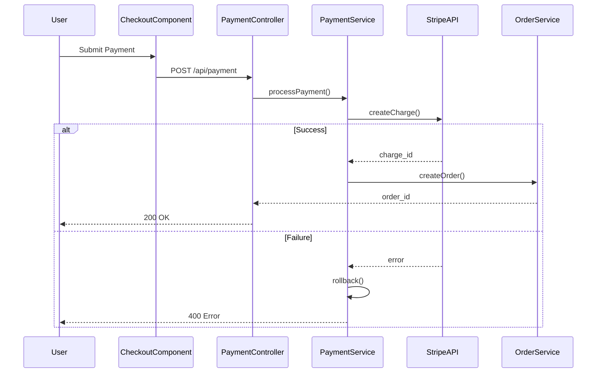

# ContextKeeper - Design Specification

## System Architecture

### Overview

ContextKeeper uses a three-layer architecture optimized for performance, scalability, and cost-efficiency:

```
┌─────────────────────────────────────────────────────────┐
│              IDE Extension Layer                         │
│  (VS Code Extension + JetBrains Plugin)                 │
│  - Context Capture  - UI Components  - Local Cache      │
└─────────────────────┬───────────────────────────────────┘
                      │ REST API / WebSocket
┌─────────────────────▼───────────────────────────────────┐
│              Backend API Layer                           │
│  (FastAPI + LangChain)                                  │
│  - Context Management  - AI Orchestration  - Auth       │
└─────────────────────┬───────────────────────────────────┘
                      │
┌─────────────────────▼───────────────────────────────────┐
│              AI & Data Layer                             │
│  Claude API | Vector DB | Graph DB | PostgreSQL         │
└─────────────────────────────────────────────────────────┘
```

### Architecture Principles

1. **Local-First**: Sensitive code never leaves user's machine without explicit consent
2. **Incremental Processing**: Index and analyze code incrementally to maintain performance
3. **Graceful Degradation**: Core features work offline or when AI services unavailable
4. **Modular Design**: Each component can be replaced or upgraded independently
5. **Cost-Optimized**: Use free tiers and efficient models to minimize operational costs

## Technology Stack

### IDE Extension Layer

**VS Code Extension**
- Language: TypeScript
- Framework: VS Code Extension API
- UI: React + Webview API
- State Management: Zustand
- Code Analysis: VS Code Language Server Protocol
- Storage: VS Code Memento API (local storage)

**JetBrains Plugin** (Future)
- Language: Kotlin
- Framework: IntelliJ Platform SDK
- UI: Swing/Kotlin UI DSL

### Backend API Layer

**Core Framework**
- FastAPI (Python 3.11+)
- Async/await for concurrent request handling
- Pydantic for data validation
- SQLAlchemy for database ORM

**AI Orchestration**
- LangChain for RAG pipeline
- Custom prompt templates
- Streaming responses for real-time feedback

**Authentication & Authorization**
- JWT tokens for API authentication
- OAuth 2.0 for third-party integrations
- Role-based access control (RBAC)

### AI & Data Layer

**AI Services**
- Claude API (Anthropic)
  - Haiku: Quick responses, context summaries (<3s)
  - Sonnet: Deep analysis, complex queries (<10s)
  - Opus: Advanced reasoning (enterprise only)
- Voyage AI: Text embeddings ($0.12/1M tokens)

**Databases**
- PostgreSQL (Supabase): Context snapshots, user data
- Qdrant: Vector database for semantic search
- Neo4j Community: Graph database for code relationships
- Redis (Upstash): Session caching, rate limiting

**Code Analysis**
- Tree-sitter: Fast AST parsing (multi-language)
- Sourcegraph SCIP: Cross-repository indexing

## Component Design

### 1. Context Snapshot System

#### 1.1 Context Capture Engine

**Responsibilities**
- Monitor workspace state changes
- Capture file states, cursor positions, edits
- Extract TODOs and comments
- Detect task switching events

**Implementation**

```typescript
interface ContextSnapshot {
  id: string;
  timestamp: Date;
  workspaceId: string;
  userId: string;
  summary: string;
  files: FileState[];
  terminal: TerminalState;
  todos: Todo[];
  metadata: SnapshotMetadata;
}

interface FileState {
  path: string;
  cursorPosition: Position;
  scrollPosition: number;
  selections: Range[];
  recentEdits: Edit[];
  language: string;
}

class ContextCaptureEngine {
  async captureContext(): Promise<ContextSnapshot> {
    const openFiles = await this.getOpenFiles();
    const terminal = await this.getTerminalState();
    const todos = await this.extractTodos(openFiles);
    
    const snapshot = {
      id: generateId(),
      timestamp: new Date(),
      files: openFiles,
      terminal,
      todos,
      // ... other fields
    };
    
    // Generate AI summary asynchronously
    this.generateSummary(snapshot);
    
    return snapshot;
  }
}
```

**Task Switch Detection**
- File change to different project/module
- Workspace folder change
- Manual trigger via command palette
- Idle time >5 minutes followed by activity

#### 1.2 Context Restoration Engine

**Responsibilities**
- Restore file layout and states
- Position cursors and scroll views
- Display context summary
- Highlight next steps

**Implementation**

```typescript
class ContextRestorationEngine {
  async restoreContext(snapshotId: string): Promise<void> {
    const snapshot = await this.loadSnapshot(snapshotId);
    
    // Close current files
    await vscode.commands.executeCommand('workbench.action.closeAllEditors');
    
    // Open files in parallel
    await Promise.all(
      snapshot.files.map(file => this.restoreFile(file))
    );
    
    // Show context panel
    this.showContextPanel(snapshot.summary, snapshot.todos);
  }
  
  private async restoreFile(file: FileState): Promise<void> {
    const doc = await vscode.workspace.openTextDocument(file.path);
    const editor = await vscode.window.showTextDocument(doc);
    
    editor.selection = new vscode.Selection(
      file.cursorPosition,
      file.cursorPosition
    );
    editor.revealRange(
      new vscode.Range(file.scrollPosition, 0, file.scrollPosition + 20, 0)
    );
  }
}
```

#### 1.3 AI Summary Generator

**Responsibilities**
- Generate natural language summary of work state
- Identify current task and progress
- Suggest next steps

**Prompt Template**

```python
CONTEXT_SUMMARY_PROMPT = """
Analyze the following developer work state and generate a concise summary.

Open Files:
{file_list}

Recent Edits:
{recent_edits}

Pending TODOs:
{todos}

Terminal Commands:
{terminal_history}

Generate a summary that answers:
1. What is the developer working on?
2. What progress has been made?
3. What are the next steps?

Format: 2-3 sentences, developer-friendly language.
"""
```

### 2. Codebase Intelligence Engine

#### 2.1 Code Indexing Pipeline

**Architecture**

```
Code Files → Tree-sitter Parser → AST Extraction → 
  ├─→ Vector Embeddings → Qdrant (semantic search)
  └─→ Relationship Graph → Neo4j (dependency analysis)
```

**Implementation**

```python
class CodeIndexer:
    def __init__(self):
        self.parser = TreeSitterParser()
        self.embedder = VoyageAIEmbedder()
        self.vector_db = QdrantClient()
        self.graph_db = Neo4jClient()
    
    async def index_repository(self, repo_path: str):
        files = self.discover_code_files(repo_path)
        
        for file in files:
            # Parse AST
            ast = self.parser.parse(file)
            
            # Extract entities
            entities = self.extract_entities(ast)
            
            # Create embeddings
            embeddings = await self.embedder.embed(entities)
            
            # Store in vector DB
            await self.vector_db.upsert(embeddings)
            
            # Build relationship graph
            relationships = self.extract_relationships(ast)
            await self.graph_db.create_relationships(relationships)
    
    def extract_entities(self, ast: AST) -> List[CodeEntity]:
        entities = []
        
        # Extract functions
        for func in ast.functions:
            entities.append(CodeEntity(
                type='function',
                name=func.name,
                signature=func.signature,
                docstring=func.docstring,
                body=func.body,
                file_path=ast.file_path,
                line_number=func.line_number
            ))
        
        # Extract classes, methods, etc.
        # ...
        
        return entities
```

**Incremental Indexing**
- Watch file system for changes
- Re-index only modified files
- Update graph relationships incrementally
- Debounce rapid changes (wait 2s after last edit)

#### 2.2 Natural Language Query Engine

**RAG Pipeline**

```
User Query → Query Embedding → Vector Search (top 10) →
  → Rerank by relevance → Retrieve full code →
  → Generate response with Claude
```

**Implementation**

```python
class QueryEngine:
    async def answer_query(self, query: str, workspace_id: str) -> QueryResponse:
        # 1. Embed query
        query_embedding = await self.embedder.embed(query)
        
        # 2. Vector search
        candidates = await self.vector_db.search(
            query_embedding,
            limit=20,
            filter={'workspace_id': workspace_id}
        )
        
        # 3. Rerank using graph context
        ranked = await self.rerank_with_graph(candidates, query)
        
        # 4. Retrieve full code context
        context = await self.build_context(ranked[:5])
        
        # 5. Generate response
        response = await self.llm.generate(
            prompt=self.build_prompt(query, context),
            model='claude-3-sonnet'
        )
        
        return QueryResponse(
            answer=response.text,
            sources=ranked[:5],
            confidence=response.confidence
        )
```

**Query Prompt Template**

```python
QUERY_PROMPT = """
You are a codebase expert assistant. Answer the developer's question using the provided code context.

Question: {query}

Relevant Code:
{code_context}

Instructions:
- Provide a clear, concise answer
- Reference specific files and line numbers
- Explain the "why" not just the "what"
- Use code examples when helpful
- If uncertain, say so and suggest where to look

Answer:
"""
```

#### 2.3 Impact Analysis Engine

**Graph Traversal Algorithm**

```python
class ImpactAnalyzer:
    async def analyze_impact(
        self,
        entity_id: str,
        max_depth: int = 3
    ) -> ImpactReport:
        # Find all entities that depend on this one
        dependents = await self.graph_db.query("""
            MATCH (target:Entity {id: $entity_id})
            MATCH (dependent:Entity)-[:CALLS|IMPORTS|EXTENDS*1..{max_depth}]->(target)
            RETURN dependent, length(path) as distance
            ORDER BY distance
        """, entity_id=entity_id, max_depth=max_depth)
        
        # Calculate confidence scores
        impact_map = {}
        for dep in dependents:
            confidence = self.calculate_confidence(dep)
            impact_map[dep.id] = ImpactNode(
                entity=dep,
                distance=dep.distance,
                confidence=confidence,
                risk_level=self.assess_risk(confidence)
            )
        
        return ImpactReport(
            target_entity=entity_id,
            affected_entities=impact_map,
            total_impact=len(impact_map),
            high_risk_count=sum(1 for n in impact_map.values() if n.risk_level == 'high')
        )
```

**Confidence Scoring**

```python
def calculate_confidence(self, dependent: Entity) -> float:
    score = 1.0
    
    # Reduce confidence for indirect dependencies
    score *= (0.8 ** dependent.distance)
    
    # Increase confidence if tests exist
    if self.has_tests(dependent):
        score *= 1.2
    
    # Reduce confidence for dynamic calls
    if dependent.is_dynamic_call:
        score *= 0.6
    
    return min(score, 1.0)
```

#### 2.4 Visual Diagram Generator

**Mermaid.js Integration**

```python
class DiagramGenerator:
    async def generate_sequence_diagram(
        self,
        flow_description: str
    ) -> Diagram:
        # Use Claude to generate Mermaid syntax
        prompt = f"""
        Generate a Mermaid.js sequence diagram for this flow:
        {flow_description}
        
        Use actual component names from the codebase.
        Include error handling paths.
        Format: Valid Mermaid syntax only.
        """
        
        mermaid_code = await self.llm.generate(prompt)
        
        # Validate syntax
        if not self.validate_mermaid(mermaid_code):
            mermaid_code = await self.fix_mermaid_syntax(mermaid_code)
        
        return Diagram(
            type='sequence',
            code=mermaid_code,
            interactive_nodes=self.extract_clickable_nodes(mermaid_code)
        )
```

**Example Output**



### 3. Proactive Context Assistant

#### 3.1 Interruption Classifier

**ML-Based Classification**

```python
class InterruptionClassifier:
    def __init__(self):
        self.llm = ClaudeClient()
    
    async def classify(self, message: Message) -> InterruptionLevel:
        prompt = f"""
        Classify this message urgency for a software developer:
        
        From: {message.sender}
        Subject: {message.subject}
        Content: {message.content}
        
        Categories:
        - CRITICAL: Production down, security breach, data loss
        - IMPORTANT: Code review needed, blocking issue, meeting reminder
        - DEFER: General questions, FYI, non-urgent requests
        
        Consider:
        - Keywords: "down", "urgent", "ASAP", "production"
        - Sender role: Manager > Teammate > External
        - Time sensitivity: Deadlines, SLAs
        
        Output: JSON with category and reasoning
        """
        
        result = await self.llm.generate(prompt, response_format='json')
        
        return InterruptionLevel(
            category=result['category'],
            confidence=result['confidence'],
            reasoning=result['reasoning']
        )
```

#### 3.2 Auto-Responder

**Context-Aware Response Generation**

```python
class AutoResponder:
    async def generate_response(
        self,
        message: Message,
        codebase_context: str
    ) -> Response:
        prompt = f"""
        Generate a helpful response to this message using codebase knowledge:
        
        Message: {message.content}
        
        Relevant Code:
        {codebase_context}
        
        Instructions:
        - Be helpful and specific
        - Include links to relevant files/docs
        - Estimate when you'll provide full response
        - Professional but friendly tone
        
        Response:
        """
        
        response_text = await self.llm.generate(prompt)
        
        return Response(
            text=response_text,
            includes_code_links=True,
            estimated_followup="within 2 hours"
        )
```

## Data Models

### Context Snapshot Schema

```sql
CREATE TABLE context_snapshots (
    id UUID PRIMARY KEY,
    user_id UUID NOT NULL,
    workspace_id UUID NOT NULL,
    created_at TIMESTAMP NOT NULL,
    summary TEXT,
    files JSONB NOT NULL,
    terminal_state JSONB,
    todos JSONB,
    tags TEXT[],
    metadata JSONB,
    INDEX idx_user_workspace (user_id, workspace_id),
    INDEX idx_created_at (created_at DESC)
);
```

### Code Entity Schema (Vector DB)

```python
@dataclass
class CodeEntity:
    id: str
    type: str  # function, class, method, variable
    name: str
    signature: str
    docstring: str
    body: str
    file_path: str
    line_number: int
    language: str
    workspace_id: str
    embedding: List[float]  # 1024-dim vector
    metadata: Dict[str, Any]
```

### Relationship Graph Schema (Neo4j)

```cypher
// Node types
CREATE (f:Function {
    id: string,
    name: string,
    file_path: string,
    line_number: int
})

CREATE (c:Class {
    id: string,
    name: string,
    file_path: string
})

// Relationship types
CREATE (f1:Function)-[:CALLS {line_number: int}]->(f2:Function)
CREATE (c1:Class)-[:EXTENDS]->(c2:Class)
CREATE (f:Function)-[:BELONGS_TO]->(c:Class)
CREATE (f:Function)-[:IMPORTS]->(m:Module)
```

## API Design

### REST Endpoints

```
POST   /api/v1/snapshots              Create context snapshot
GET    /api/v1/snapshots              List user's snapshots
GET    /api/v1/snapshots/:id          Get snapshot details
DELETE /api/v1/snapshots/:id          Delete snapshot
POST   /api/v1/snapshots/:id/restore  Restore context

POST   /api/v1/query                  Natural language query
POST   /api/v1/analyze/impact         Impact analysis
POST   /api/v1/diagrams/generate      Generate diagram

POST   /api/v1/index/repository       Index repository
GET    /api/v1/index/status           Get indexing status
POST   /api/v1/index/incremental      Incremental update

GET    /api/v1/user/profile           Get user profile
PUT    /api/v1/user/settings          Update settings
```

### WebSocket Events

```
// Client → Server
snapshot:create
snapshot:restore
query:ask
index:start

// Server → Client
snapshot:created
snapshot:restored
query:response (streaming)
index:progress
index:complete
```

## Security Design

### Authentication Flow

```
1. User installs extension
2. Extension opens OAuth flow in browser
3. User authenticates with GitHub/Google
4. Backend issues JWT token (7-day expiry)
5. Extension stores token securely (VS Code SecretStorage)
6. All API requests include: Authorization: Bearer <token>
```

### Data Privacy

**Local-First Architecture**
- Code analysis happens locally when possible
- Only metadata sent to backend (file paths, function names)
- Full code sent only for AI queries (with user consent)
- User can opt-out of cloud features entirely

**Encryption**
- TLS 1.3 for all API communication
- AES-256 encryption for stored snapshots
- Encrypted embeddings (homomorphic encryption for enterprise)

**Access Control**
- User can only access their own snapshots
- Workspace-level isolation
- Admin roles for enterprise (view team analytics only)

## Performance Optimization

### Caching Strategy

```python
# Multi-layer caching
class CacheManager:
    def __init__(self):
        self.l1_cache = LRUCache(maxsize=100)  # In-memory
        self.l2_cache = RedisCache()            # Distributed
        self.l3_cache = PostgreSQL()            # Persistent
    
    async def get(self, key: str) -> Optional[Any]:
        # Check L1
        if value := self.l1_cache.get(key):
            return value
        
        # Check L2
        if value := await self.l2_cache.get(key):
            self.l1_cache.set(key, value)
            return value
        
        # Check L3
        if value := await self.l3_cache.get(key):
            await self.l2_cache.set(key, value, ttl=3600)
            self.l1_cache.set(key, value)
            return value
        
        return None
```

### Query Optimization

**Vector Search**
- Use HNSW index for fast approximate search
- Pre-filter by workspace_id before vector search
- Limit results to top 20, rerank to top 5

**Graph Queries**
- Index frequently accessed paths
- Limit traversal depth to 3 levels
- Cache common dependency patterns

### Lazy Loading

```typescript
// Load code entities on-demand
class LazyCodeLoader {
  async loadEntity(entityId: string): Promise<CodeEntity> {
    // Check cache first
    if (this.cache.has(entityId)) {
      return this.cache.get(entityId);
    }
    
    // Load from backend
    const entity = await this.api.getEntity(entityId);
    
    // Cache for future use
    this.cache.set(entityId, entity);
    
    return entity;
  }
}
```

## Deployment Architecture

### Development Environment

```yaml
services:
  backend:
    image: contextkeeper-api:dev
    ports: ["8000:8000"]
    environment:
      - DATABASE_URL=postgresql://localhost/contextkeeper_dev
      - REDIS_URL=redis://localhost:6379
      - CLAUDE_API_KEY=${CLAUDE_API_KEY}
  
  postgres:
    image: postgres:15
    ports: ["5432:5432"]
  
  redis:
    image: redis:7
    ports: ["6379:6379"]
  
  qdrant:
    image: qdrant/qdrant:latest
    ports: ["6333:6333"]
  
  neo4j:
    image: neo4j:5-community
    ports: ["7474:7474", "7687:7687"]
```

### Production Environment (Railway/Render)

```
┌─────────────────────────────────────────┐
│         Load Balancer (Railway)         │
└────────────┬────────────────────────────┘
             │
    ┌────────┴────────┐
    │                 │
┌───▼────┐      ┌────▼───┐
│ API    │      │ API    │  (Auto-scaling)
│ Server │      │ Server │
└───┬────┘      └────┬───┘
    │                │
    └────────┬───────┘
             │
    ┌────────▼────────────────────────┐
    │  Managed Services               │
    │  - Supabase (PostgreSQL)        │
    │  - Upstash (Redis)              │
    │  - Qdrant Cloud (Vectors)       │
    │  - Neo4j Aura (Graph)           │
    └─────────────────────────────────┘
```

## Monitoring & Observability

### Metrics to Track

```python
# Performance metrics
- api_request_duration_seconds (histogram)
- snapshot_creation_duration_seconds (histogram)
- query_response_duration_seconds (histogram)
- index_processing_duration_seconds (histogram)

# Business metrics
- snapshots_created_total (counter)
- queries_executed_total (counter)
- active_users_daily (gauge)
- context_switches_prevented_total (counter)

# Error metrics
- api_errors_total (counter by error_type)
- ai_request_failures_total (counter)
- index_failures_total (counter)
```

### Logging Strategy

```python
import structlog

logger = structlog.get_logger()

# Structured logging
logger.info(
    "snapshot_created",
    user_id=user_id,
    workspace_id=workspace_id,
    file_count=len(files),
    duration_ms=duration
)
```

### Alerting Rules

```yaml
alerts:
  - name: HighErrorRate
    condition: error_rate > 5%
    duration: 5m
    action: page_oncall
  
  - name: SlowQueryResponse
    condition: p95_query_duration > 15s
    duration: 10m
    action: notify_slack
  
  - name: IndexingStalled
    condition: index_queue_size > 1000
    duration: 30m
    action: notify_slack
```

## Testing Strategy

### Unit Tests

```python
# Test context capture
def test_context_capture():
    engine = ContextCaptureEngine()
    snapshot = await engine.captureContext()
    
    assert snapshot.id is not None
    assert len(snapshot.files) > 0
    assert snapshot.timestamp is not None

# Test query engine
def test_query_engine():
    engine = QueryEngine()
    response = await engine.answer_query(
        "Where is authentication handled?",
        workspace_id="test-workspace"
    )
    
    assert response.answer is not None
    assert len(response.sources) > 0
    assert response.confidence > 0.7
```

### Integration Tests

```python
# Test end-to-end snapshot flow
async def test_snapshot_flow():
    # Create snapshot
    snapshot = await api.post("/api/v1/snapshots", data={
        "files": [...],
        "workspace_id": "test"
    })
    
    # Verify stored
    retrieved = await api.get(f"/api/v1/snapshots/{snapshot.id}")
    assert retrieved.id == snapshot.id
    
    # Restore
    result = await api.post(f"/api/v1/snapshots/{snapshot.id}/restore")
    assert result.status == "success"
```

### Performance Tests

```python
# Load test query endpoint
async def test_query_performance():
    queries = [
        "Where is user authentication?",
        "Show me payment processing",
        # ... 100 queries
    ]
    
    start = time.time()
    results = await asyncio.gather(*[
        api.post("/api/v1/query", {"query": q})
        for q in queries
    ])
    duration = time.time() - start
    
    assert duration < 30  # 100 queries in <30s
    assert all(r.duration < 10 for r in results)  # Each <10s
```

## Cost Analysis

### Infrastructure Costs (Monthly)

```
Service              Free Tier    100 Users    1,000 Users   10,000 Users
─────────────────────────────────────────────────────────────────────────
Claude API           $0           $30          $250          $2,500
Voyage AI            $0           $1           $10           $100
Supabase (Postgres)  $0           $0           $25           $250
Upstash (Redis)      $0           $0           $10           $100
Qdrant Cloud         $0           $0           $95           $950
Neo4j Aura           $0           $65          $195          $1,950
Railway (Hosting)    $0           $5           $20           $200
─────────────────────────────────────────────────────────────────────────
TOTAL                $0           $101         $605          $6,050
Per User             $0           $1.01        $0.61         $0.61
```

### Cost Optimization Strategies

1. **Caching**: Reduce AI API calls by 60%
2. **Model Selection**: Use Haiku for simple tasks (10x cheaper)
3. **Batch Processing**: Group embeddings to reduce API calls
4. **Compression**: Compress stored snapshots (50% reduction)
5. **TTL Policies**: Auto-delete old snapshots after 90 days

## Hackathon Implementation Plan

### Day 1: Foundation (16 hours)

**Hours 0-4: Setup**
- Initialize VS Code extension project
- Set up FastAPI backend
- Configure Claude API
- Set up Supabase database

**Hours 4-8: Context Capture**
- Implement workspace state capture
- Build snapshot storage API
- Create basic UI for "Save Context"
- Test snapshot/restore cycle

**Hours 8-12: Basic RAG**
- Integrate Tree-sitter
- Set up Qdrant vector DB
- Implement code chunking
- Build Q&A endpoint

**Hours 12-16: Extension UI**
- Create React sidebar panel
- Add chat interface
- Implement context switcher
- Test end-to-end flow

### Day 2: Intelligence (16 hours)

**Hours 16-20: Graph Database**
- Set up Neo4j
- Build relationship graph
- Implement graph queries

**Hours 20-24: Visual Diagrams**
- Integrate Mermaid.js
- Create diagram generation prompts
- Render diagrams in panel

**Hours 24-28: Smart Summaries**
- Implement AI summaries
- Add next steps suggestions
- Improve prompt quality

**Hours 28-32: Demo Polish**
- Create demo repository
- Pre-index demo repo
- Record demo video
- Prepare slides

### Day 3: Presentation (8 hours)

- Bug fixes
- UI/UX improvements
- Deploy backend
- Package extension
- Practice presentation

## Future Enhancements

### Phase 2 (3-6 months)
- JetBrains plugin
- Team collaboration features
- Custom AI model fine-tuning
- Advanced analytics dashboard

### Phase 3 (6-12 months)
- Self-hosted enterprise deployment
- Multi-language support (UI)
- Mobile companion app
- Integration with Jira, Linear, etc.

### Phase 4 (12+ months)
- Predictive context switching
- Automated code review
- Team knowledge sharing
- AI pair programming mode

## Conclusion

This design provides a comprehensive blueprint for building ContextKeeper as a production-ready system. The architecture is optimized for:

- **Performance**: Sub-10s query responses, <5s context restoration
- **Scalability**: Handles 10,000+ users, 500k+ file codebases
- **Cost-efficiency**: <$1/user/month at scale
- **Developer experience**: Zero-config, intuitive UI, seamless workflow

The modular design allows for incremental development and easy replacement of components as technology evolves.
